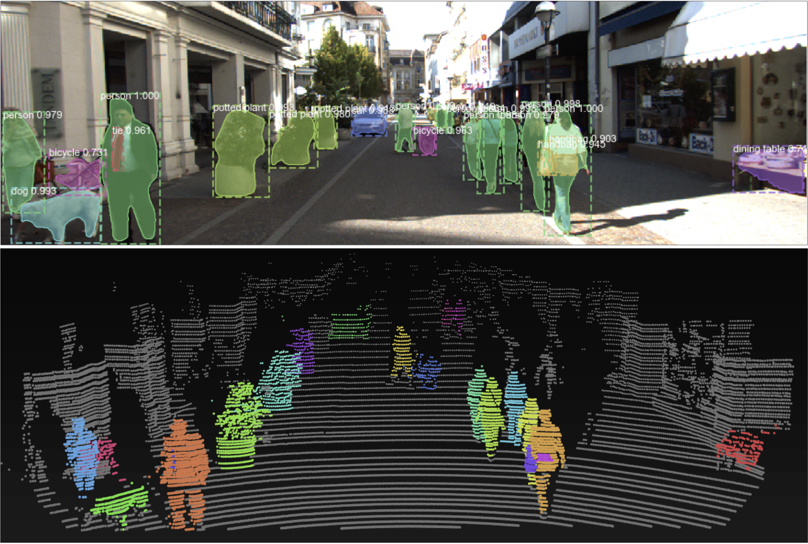

# LDLS: Label Diffusion LiDAR Segmentation

LDLS performs 3D instance segmentation of LiDAR point clouds, by using a pretrained Mask-RCNN model to perform 2D segmentation of an aligned camera image, projecting segmentation masks into 2D, and then performing label diffusion to output final LiDAR point labels.

LDLS requires no annotated 3D training data, and is capable of performing segmentation of any object class that the 2D image segmentation model is trained to recognize.

## Installation

Requires Python 3.6+

1. Install the Matterport Mask R-CNN implementation: See [here](https://github.com/matterport/Mask_RCNN).
2. Install dependencies with `pip install -r`

Additionally, we highly recommend installing the [Point Processing Toolkit](https://github.com/heremaps/pptk) for visualizing results:

``pip install pptk``

## How to use

## Current work

Current improvements we are making to LDLS include:

- Implementing GPU acceleration for real-time performance.
- Writing a ROS node for online point cloud segmentation.
